# Mlopszoomcamp final project

This project aims to show how to apply MLOps on your data science project to make it run on the cloud with zero cost.

Everything will run on the cloud. You will go from model training, experiment tracking, model registry and deploying whitouth the need of a local server.

https://github.com/ibombonato/mlops-showcase

## What this project covers?

- Demonstrate practical aspects of productionizing ML services with one "End to End Project"
- Focus on the "Ops" part not the "ML". We will use a dummy model in the examples.
- Train a model and track the experiments
- Model training pipeline that runs on the cloud every time a Pull Request is made and show basic metrics
- Model Registry
- Model deployment as a batch service that runs on the cloud scheduled
- Model retraining and deploy if metrics fall bellow a treshold
- Best pratices of software engineering. (UnitTests, Integration Test, Docker, Linter, Makefile, Pre Commit Hooks, CI/CD)

## What this DO NOT cover?

Since the goal is to view the lifecycle of a model, this project does not address the ins and outs of modeling/machine learning, we will use a synthetic dataset and make a pretty basic model on top of it.

Also it do not aims to have extensive code coverage or demonstrate how to effectively write unit tests. They are here just to show that it can be run with pre commit hooks, using make files and in the build phase.

## Project Overview

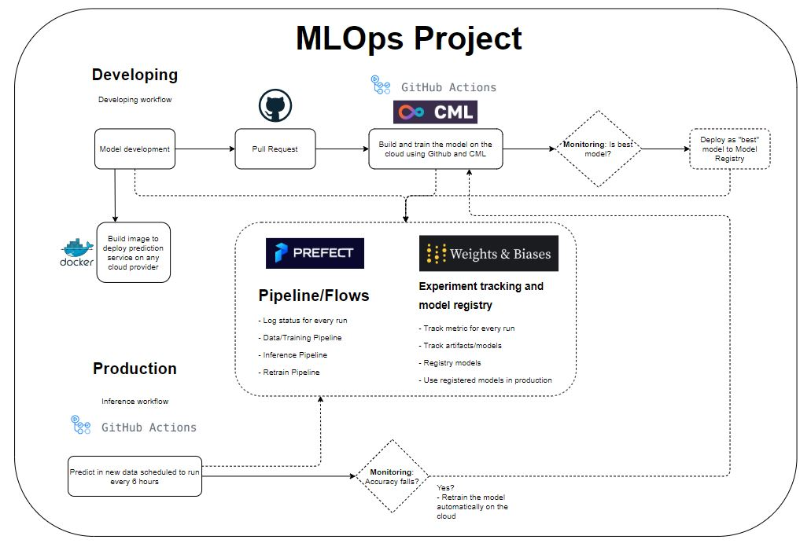

## Requirements

To run the project, you will need the cloud services bellow:

- Github. https://github.com
- Prefect Cloud. https://www.prefect.io/
- Weights & Biases. https://wandb.ai/

All of then are free to use in the scope of the project. You may need/want to upgrade your plan if you have a bigger scope.

The project itself will make use of:
- Python 3.8
- Prefect Cloud
- Weights & Biases
- CML - [Continuous Machine Learning from DVC - Iterative.ai](https://github.com/iterative/cml#getting-started)
- Github
- Github Actions
- Pipenv
- Docker

## Setup

Assuming you already create your account on Github, Prefect and Wandb, everything will run on the cloud and you just need to clone the project on github and adjust your environment varables to setting up your project.

You should create and API KEY for Prefect and Wandb and pass it as environment variables at run time.

On github, this is done through the [GITHUB SECRETS](https://docs.github.com/en/actions/security-guides/encrypted-secrets)

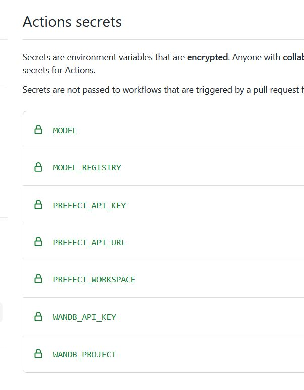

A `sample.env` file shows the environment variables needed.

```
PREFECT_WORKSPACE=PREFECT_USER/PREFECT_WORKSPACE
PREFECT_API_URL=https://api.prefect.cloud/api/accounts/[USER-ID]/workspaces/[WORKSPACE-ID]
PREFECT_API_KEY=ABCDEFGH

WANDB_API_KEY=ABCDEFGHIJ
WANDB_PROJECT=WANDB-PROJECT
MODEL_REGISTRY=WANDB-MODEL-REGISTRY/WANDB-PROJECT
MODEL=WANDBUSER/WANDB-MODEL-REGISTRY/WANDB-PROJECT
```

If you want to run local, you need to use pipenv to install all dependencies and install Prefect/Wandb on premisses.

You can not run Github Actions locally.

## Peer review criteria

### Problem description

The problem is described above and should be clear :)

### Cloud

Everything runs on the cloud, using Prefect Cloud, Wandb Cloud, CML and Github Actions

The infra for the project is created via code, IaC, using YAML files on the github actions, and we dont need to manage it :)

[CML](https://github.com/iterative/cml#getting-started) Can spin up the worker at AWS, GCP, Azure and so on. You just need to change your Github Action configuration as bellow and CML uses Terraform IaC under the hood.

```
# From Iterative docs:
name: Train-in-the-cloud
on: [push]
jobs:
  deploy-runner:
    runs-on: ubuntu-latest
    steps:
      - uses: iterative/setup-cml@v1
      - uses: actions/checkout@v2
      - name: Deploy runner on EC2
        env:
          REPO_TOKEN: ${{ secrets.PERSONAL_ACCESS_TOKEN }}
          AWS_ACCESS_KEY_ID: ${{ secrets.AWS_ACCESS_KEY_ID }}
          AWS_SECRET_ACCESS_KEY: ${{ secrets.AWS_SECRET_ACCESS_KEY }}
        run: |
          cml runner \
            --cloud=aws \
            --cloud-region=us-west \
            --cloud-type=g4dn.xlarge \
            --labels=cml-gpu
```

## Model Tracking and Register

The project uses Weights & Biases for **BOTH Experiment Tracking and Model Registry**. It is like MLFlow, but it runs on the cloud like Prefect.

At every train/pipeline run, the model and metrics are saved to the Experiment Tracking and the Model Registry. If the new model has the best accuracy, it will go for production.

https://wandb.ai/

All the docs to get started is on the site:
https://docs.wandb.ai/quickstart

For this project, you will need to setup up your account and get your API KEY to use as an environment variable.

You can view the model registry in action inside wandb and get model history and model by tag. Ie: "latest", "best"

You can also make your project public, so anyone can view it.

For this project, the experiment tracking and model registry are public:

Experiment Tracker:
https://wandb.ai/ibombonato/MLOPS-TEST-PROJECT?workspace=user-ibombonato

Model Registry:
https://wandb.ai/ibombonato/model-registry/artifacts/model/mlops-test/v19

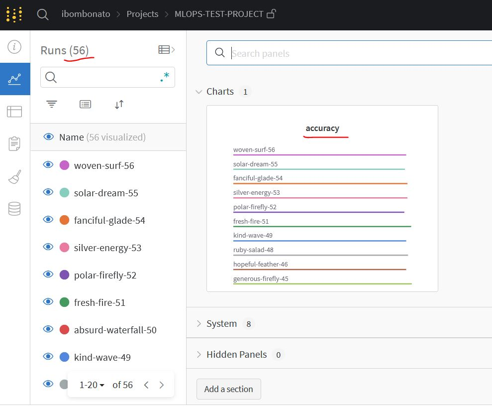

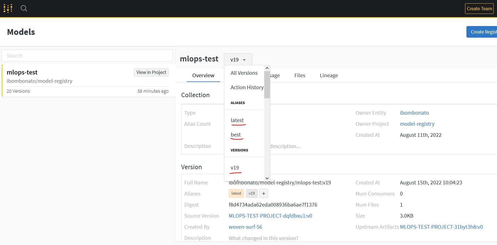

## Workflow Orchestration

The project uses a fully deplyed workflow, where Prefect is responsible for the pipelines and Github actions to schedule and run all the process.

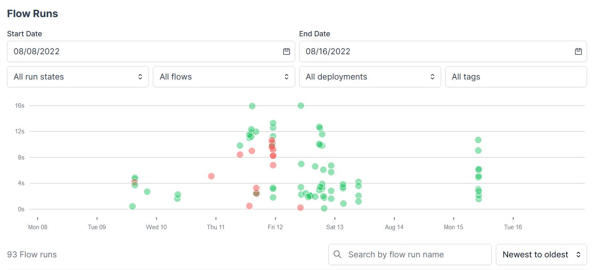

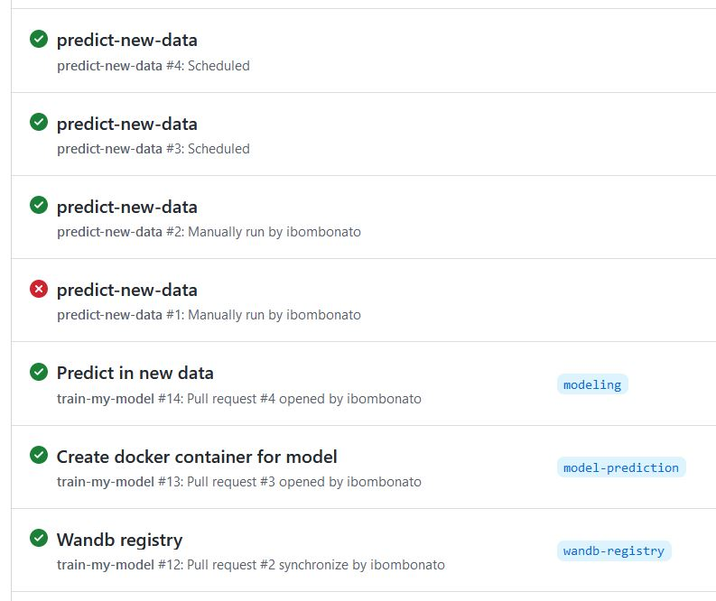


## Model deployment - Docker

The model deployment code is containerized and could be deployed to cloud.

To build the image for prediction, you should run:

`docker build -t my-user/my-image-name .`

To run it, you can use:
Note that you need to pass all the environment variables. One way is to inform a `.env` file with `--env-file` option:
`docker run --rm --env-file sample.env my-user/my-image-name`

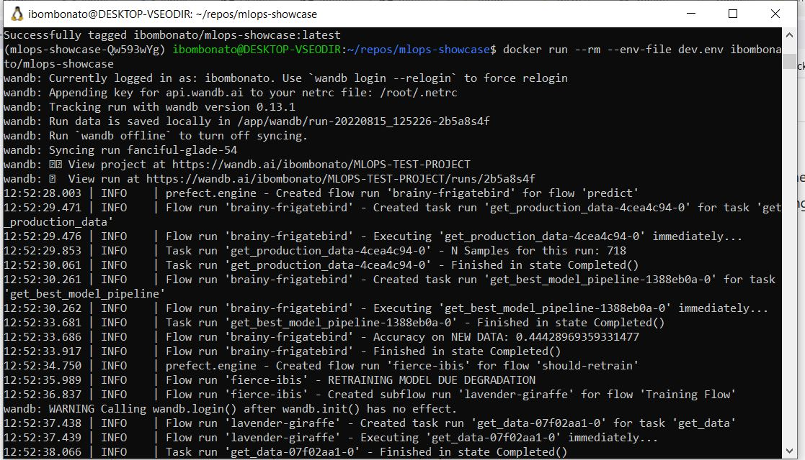

## Model monitoring

Every time a Pull Request is made to the repo, it triggers the train pipeline. The train pipeline with train the model and report the metrics as a comment/alert inside the pull request.

Knowing that metric, you can put the model to prodution by changing its tag to "best" on model registry.

It also **RUNS A CONDITIONAL WORKFLOW** if Accuracy in new data is bellow a treshold (model degradation) and if it is, it will call the retrain pipeline automatically!

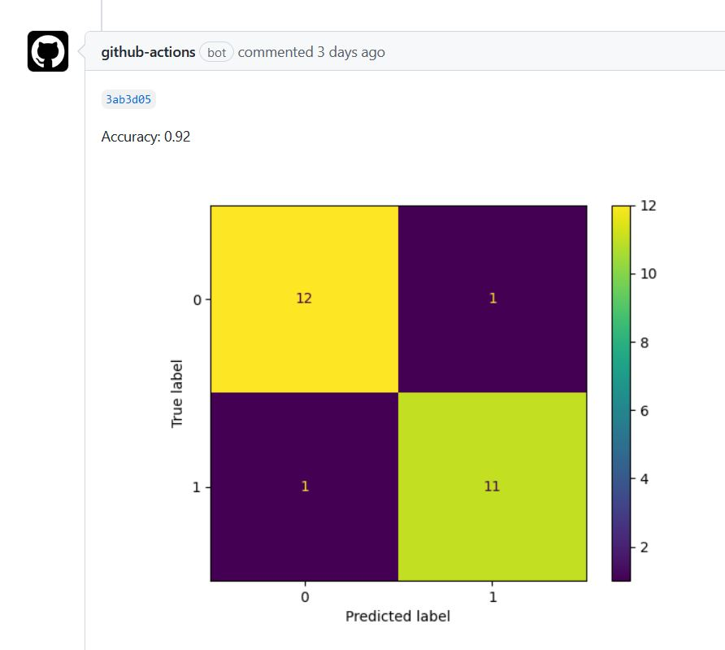

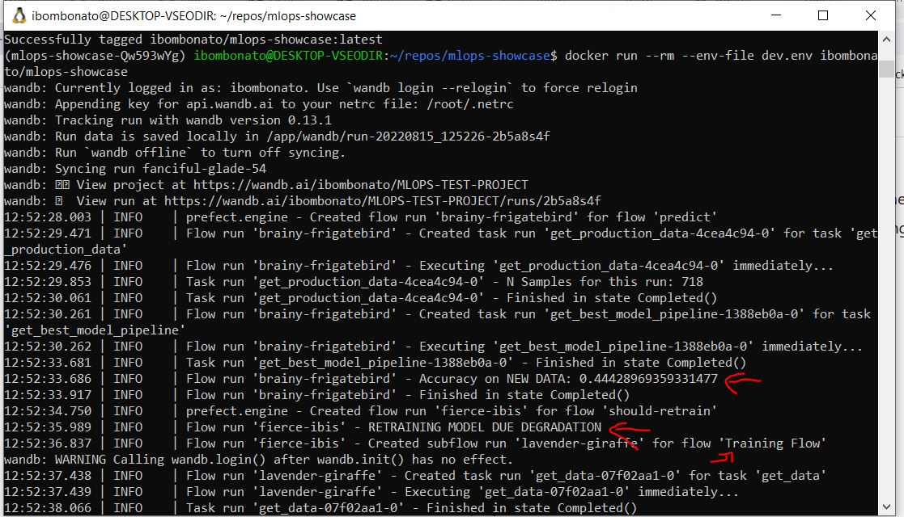

## Reproducibility

I hope that you can reproduce it with the instruction above/bellow :)

Makefile as default will work with a `dev.env` file, not inside the repo due to `.gitignore` and sensitive information. This `dev.env` should contain all environment variables for the project, as in `sample.env` file (sample env file inside the project).

To install pipenv and pre-commit:
`make setup_dev`

To run tests and quality checks:
`make run`

To run the training pipeline:
`make train_model`

To run the prediction:
`make predict_model`

To build docker image:
`make build-image`

To run docker image:
`make run-image`

*Docker note: Adjust the name of the image inside Makefile*

## Best practices

This project follow software engineering best pratices and make uses of:
- Unit tests - Simple use cases showing that it can be suported in the lifecicle
- Integration test - If the code/worflow breaks, it will not pass the pull request checks
- Linter and/or code formatter are used. Isort, Black and Pylint
- There's a Makefile where you can run predefined commands
- There are pre-commit hooks:
    -   id: trailing-whitespace
    -   id: end-of-file-fixer
    -   id: check-yaml
    -   id: check-added-large-files
- There's a CI/CI pipeline with GitHub Actions

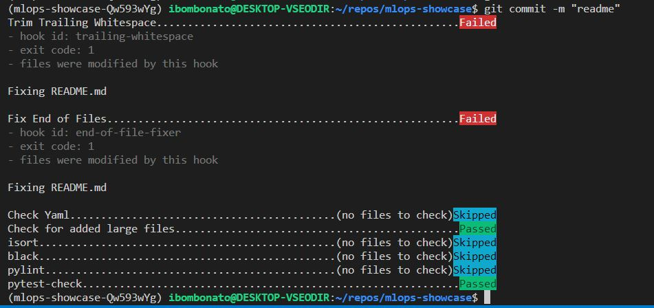

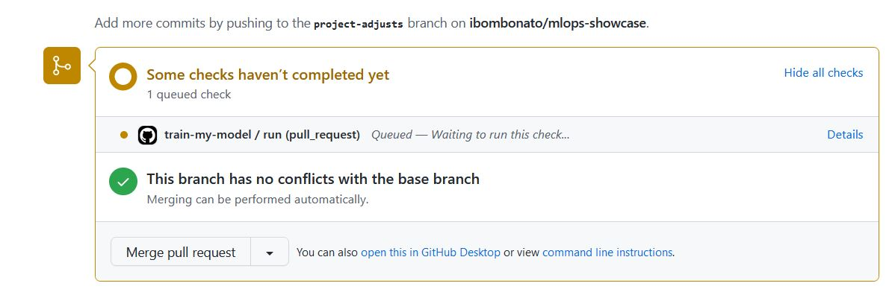

## Caveats

As stated by Alexey Grigorev the project could use synthetic data

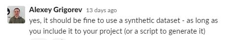

Also it confirms that Prefect with GitHub Actions count as a Full Workflow.

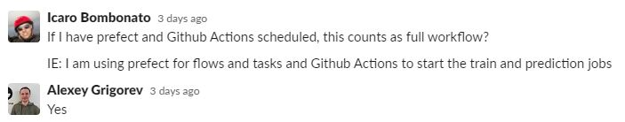
